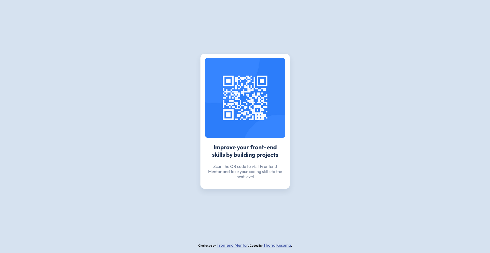

# Frontend Mentor - QR code component solution

This is a solution to the [QR code component challenge on Frontend Mentor](https://www.frontendmentor.io/challenges/qr-code-component-iux_sIO_H). Frontend Mentor challenges help you improve your coding skills by building realistic projects. 

## Table of contents

- [Frontend Mentor - QR code component solution](#frontend-mentor---qr-code-component-solution)
  - [Table of contents](#table-of-contents)
  - [Overview](#overview)
    - [Screenshot](#screenshot)
    - [Links](#links)
  - [My process](#my-process)
    - [Built with](#built-with)
    - [What I learned](#what-i-learned)
    - [Useful resources](#useful-resources)
  - [Author](#author)

**Note: Delete this note and update the table of contents based on what sections you keep.**

## Overview

### Screenshot



### Links

- Solution URL: [Add solution URL here](https://your-solution-url.com)
- Live Site URL: [Add live site URL here](https://your-live-site-url.com)

## My process

### Built with

- Semantic HTML5 markup
- CSS custom properties
- Flexbox
- CSS Grid
- Mobile-first workflow

### What I learned

In this project I learn more about semantic HTML and CSS usages. I'm learning how to use CSS Flexbox and CSS Grid system. All that I do in here I'm using Vanilla CSS and HTML only.

To see how you can add code snippets, see below:

```html
    <div class="container">
      
      <h1>Improve your front-end skills by building projects</h1>
      <p>
        Scan the QR code to visit Frontend Mentor and take your coding skills to
        the next level
      </p>
    </div>
```
```css
body {
  background-color: var(--light-gray);
  height: 100vh;
  display: flex;
  flex-direction: column;
}

.container {
  box-sizing: border-box;
  background-color: var(--white);
  display: grid;
  row-gap: 20px;
  grid-template: auto;
  width: 321px;
  height: fit-content;
  border-radius: 15px;
  padding: 15px;
  text-align: center;
  margin: auto;
  box-shadow: 0 10px 20px rgba(31, 50, 81, 10%);
}
```

### Useful resources

- [MDN Web Docs](https://developer.mozilla.org/en-US/) - This helped me for learning more about CSS Styling.

## Author

- Website - [Thoriq Kusuma](https://prmdtya-links.vercel.app)
- Frontend Mentor - [@prmditya](https://www.frontendmentor.io/profile/prmditya)
- GitHub - [prmditya](https://github.com/prmditya)
